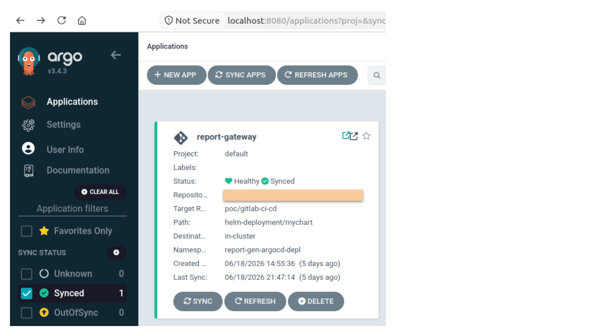
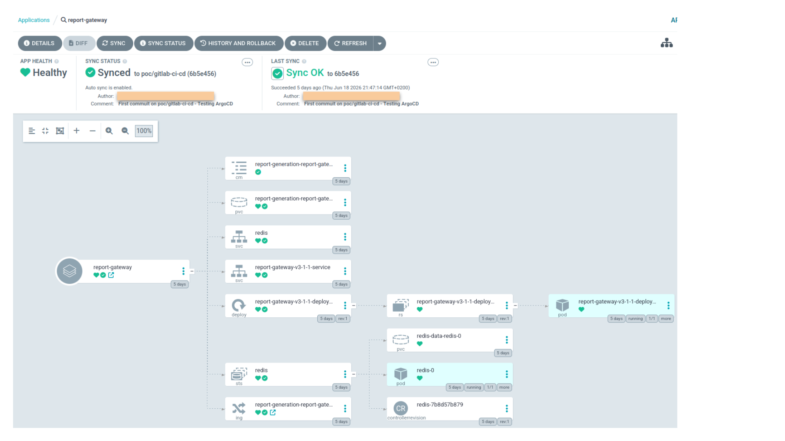

# How to get started with Argo CD

This README walks through the process of installing Argo CD, granting it access to the GitLab `app-deployment-repo` repository, securing the repository credentials with `Bitnami Sealed Secrets`, and troubleshooting the deployment of the `app-name` application.

Indeed, in this use case, the `app-name` application is deployed from the GitLab `app-deployment-repo` repository.

Throughout this guide, the GitLab repository is assumed to be hosted at `gitlab.internal.instance.com`, which resolves to the IP address `<GITLAB_INTERNAL_INSTANCE_IP>`.

In the following document, `"Oryx"` serves as the Kubernetes **control-plane node**, **administration node** (`kubectl`/kubeconfig), and **bastion/jump host** providing access to the cluster and its worker nodes.

The following environment variables are used throughout the examples in this document:
```bash
export ARGOCD_NAMESPACE=argocd-ns
export GITLAB_SECRET=gitlab-project-repo-secret
export APP_NAMESPACE=app-name-argocd-depl-ns
export APP_NAME=app-name
export APP_HOST=app-name-argocd
export GITLAB_HOST=gitlab.internal.instance.com
export GITLAB_REPO_URL=http://gitlab.internal.instance.com/group-example/app-deployment-repo.git
export GITLAB_BRANCH=branch/to/commit
export GITLAB_IP=<GITLAB_INTERNAL_INSTANCE_IP>
```

For demonstration purposes, the examples below use a placeholder branch name (`branch/to/commit`). In a production environment, deployments are typically performed from the `main` branch, which serves as the source of truth for the application manifests and configuration.

Important: never commit `gitlab-repo-secret.yaml` with a cleartext token.</br>
The file that can be committed is `gitlab-repo-sealedsecret.yaml`.


## I. Install ArgoCD and declare the Argo CD Application

The goal is to replace manual Helm deployments:
```bash
helm upgrade --install app-name ./mychart -n "${APP_NAMESPACE}"
```

with a GitOps-driven workflow managed by Argo CD:
```text
Git change
  → Argo CD detects it
    → Argo CD renders the Helm chart
      → Kubernetes is updated
```

Target repository structure (extracted from the Report Deployment GitLab project):
<pre>
app-deployment-repo/
└── helm-deployment/
    ├── mychart/
    │   ├── Chart.yaml
    │   ├── values.yaml
    │   └── templates/
    └── argocd/
        ├── <b>app-name-application.yaml</b>
        └── gitlab-repo-sealedsecret.yaml
</pre>

Key Argo CD file: `argocd/app-name-application.yaml`

In its current state, this file declares:
```yaml
apiVersion: argoproj.io/v1alpha1
kind: Application

metadata:
  name: app-name
  namespace: argocd-ns
  # ==== The `Application` object lives in this namespace ====

spec:
  project: default

  source:
    repoURL: http://gitlab.internal.instance.com/group-example/app-deployment-repo.git
    targetRevision: branch/to/commit
    path: helm-deployment/mychart
    # ==== Argo CD reads the `branch/to/commit` branch, from the `helm-deployment/mychart` directory ====

    helm:
      valueFiles:
        - values.yaml
        # ==== Logical equivalent of `helm template helm-deployment/mychart -f values.yaml` ====

  destination:
    server: https://kubernetes.default.svc
    namespace: app-name-argocd-depl-ns
    # ==== Argo CD deploys the application to the same cluster, in the `app-name-argocd-depl-ns` namespace ====

  syncPolicy:
    automated:
      prune: true
      selfHeal: true
    syncOptions:
      - CreateNamespace=true
    # ==== `prune: true` removes from Kubernetes resources that were removed from Git ====
    # ==== `selfHeal: true` restores the Git state if someone manually changes the cluster with `kubectl edit` ====
    # ==== `syncPolicy.automated` auto-sync lets Argo CD synchronize auto. when it detects a drift between Git and the Kubernetes cluster ====
```


### 1. Install Argo CD in the chosen namespace

To stay consistent with the manifests and the errors encountered, the commands below use `ARGOCD_NAMESPACE=argocd-ns`.

```bash
kubectl create namespace "${ARGOCD_NAMESPACE}"

kubectl apply -n "${ARGOCD_NAMESPACE}" --server-side --force-conflicts \
  -f https://raw.githubusercontent.com/argoproj/argo-cd/stable/manifests/install.yaml


# Verification:
kubectl get pods -n "${ARGOCD_NAMESPACE}"
```

→ You should see components such as:
```text
argocd-application-controller
argocd-server
argocd-repo-server
argocd-redis
argocd-dex-server
```


### 2. Access the Argo CD UI

From the machine that has access to the cluster:
```bash
kubectl port-forward svc/argocd-server -n "${ARGOCD_NAMESPACE}" 8080:443


# Then on another terminal on Oryx:
curl -k -I https://localhost:8080
```

If `kubectl port-forward` is running on Oryx but the browser is on your local workstation, first open an SSH tunnel from your workstation:

```bash
ssh -L 8080:127.0.0.1:8080 <my-session>@oryx


# Then, in that SSH session on Oryx:
kubectl port-forward svc/argocd-server -n "${ARGOCD_NAMESPACE}" 8080:443

# Possible variant, less clean because it exposes the port on the LAN:
kubectl port-forward --address 0.0.0.0 svc/argocd-server -n "${ARGOCD_NAMESPACE}" 8080:443
```

→ Then open:
```text
https://localhost:8080
```

→ Retrieve the initial admin password:
```bash
kubectl -n "${ARGOCD_NAMESPACE}" get secret argocd-initial-admin-secret \
  -o jsonpath="{.data.password}" | base64 -d
echo
```

→ Login:
```text
username: admin
password: the one retrieved just above
```


### 3. Understand the Argo CD components used here

<pre>
<b>argocd-server</b>
  web UI + API

<b>argocd-repo-server</b>
  clones the Git repository and renders Helm/Kustomize/YAML manifests

<b>argocd-application-controller</b>
  compares Git with Kubernetes and applies changes

argocd-redis
  internal cache

argocd-dex-server
  auth/OIDC, not essential at the beginning
</pre>

For this guide, the two most important components are:
```text
application-controller = brain
repo-server = component that reads Git and renders Helm
server = interface
```


### 4. Create or let Argo CD create the application namespace

The target namespace for the application is: `app-name-argocd-depl-ns`

Argo CD can create it through `CreateNamespace=true`, but for initial debugging, manual creation makes things easier to read:
```bash
kubectl create namespace "${APP_NAMESPACE}"
```


### 5. Apply the Argo CD application

```bash
# From the root of the `app-deployment-repo` repository:
kubectl apply -f helm-deployment/argocd/app-name-application.yaml


# Verification on the Argo CD side:
kubectl get applications -n "${ARGOCD_NAMESPACE}"
kubectl describe application "${APP_NAME}" -n "${ARGOCD_NAMESPACE}"

# Verification on the application namespace side:
kubectl get all -n "${APP_NAMESPACE}"
kubectl get ingress -n "${APP_NAMESPACE}"
```

→ Expected test once the application is synchronized. This curl should work:
```bash
curl -I http://${APP_HOST}.<CLUSTER_IP>.nip.io/docs
```


## II. Secure GitLab access with SealedSecret

Argo CD needs to clone a private GitLab repository. To enable this, a repository-type Kubernetes `Secret` must be created and labeled for Argo CD:
```yaml
argocd.argoproj.io/secret-type: repository
```

But this secret contains a GitLab token. It must therefore not be committed in cleartext.

SealedSecret principle:
```text
Local cleartext Secret
  → kubeseal encrypts it
    → committable SealedSecret
      → cluster controller decrypts it
        → real Kubernetes Secret
```

The local cleartext file can look like this, but it **must not be committed**:

```yaml
apiVersion: v1
kind: Secret
metadata:
  name: gitlab-project-repo-secret
  namespace: argocd-ns
  labels:
    argocd.argoproj.io/secret-type: repository
type: Opaque
stringData:
  type: git
  url: http://gitlab.internal.instance.com/group-example/app-deployment-repo.git
  username: <my_username>
  password: <MY_PRIVATE_GITLAB_ACCESS_TOKEN>
```

The committable file is: `helm-deployment/argocd/gitlab-repo-sealedsecret.yaml`


### 1. Install the SealedSecret controller

```bash
kubectl apply -f https://github.com/bitnami-labs/sealed-secrets/releases/download/v0.32.1/controller.yaml


# Verify with:
kubectl get pods -n kube-system | grep sealed
kubectl describe pod <pod-name> -n kube-system | grep sealed
```

→ If you face a *ErrImagePull* or a *ImagePullBackOff* issue at this step, please follow the steps below, part III.


### 2. Install `kubeseal`

There are two different things:

```text
sealed-secrets-controller
  installed in the Kubernetes cluster

kubeseal
  binary installed on the machine from which you control the cluster (Oryx)
```

If you run your `kubectl` commands from your Kubernetes administration machine (Oryx), install `kubeseal` on it.

```bash
wget https://github.com/bitnami-labs/sealed-secrets/releases/download/v0.32.1/kubeseal-0.32.1-linux-amd64.tar.gz

tar -xvzf kubeseal-0.32.1-linux-amd64.tar.gz
sudo install -m 755 kubeseal /usr/local/bin/kubeseal


# Verify with:
kubeseal --version
```


### 3. Create the SealedSecret without writing the token in cleartext to Git

This command assumes that the Sealed Secrets controller and `kubeseal` are installed. Their installation is detailed above.

```bash
export GITLAB_PERSONAL_ACCESS_TOKEN='<YOUR_GITLAB_TOKEN>'


# From the root of the `app-deployment-repo` repository:
cat <<EOF | kubeseal \
  --controller-name=sealed-secrets-controller \
  --controller-namespace="${ARGOCD_NAMESPACE}" \
  --format=yaml \
  > helm-deployment/argocd/gitlab-repo-sealedsecret.yaml
apiVersion: v1
kind: Secret
metadata:
  name: ${GITLAB_SECRET}
  namespace: ${ARGOCD_NAMESPACE}
  labels:
    argocd.argoproj.io/secret-type: repository
type: Opaque
stringData:
  type: git
  url: ${GITLAB_REPO_URL}
  username: <my_username>
  password: ${GITLAB_PERSONAL_ACCESS_TOKEN}
EOF
```

Commit only: `helm-deployment/argocd/gitlab-repo-sealedsecret.yaml`

Do not commit: `helm-deployment/argocd/gitlab-repo-secret.yaml`


### 4. Apply the SealedSecret

```bash
kubectl apply -f helm-deployment/argocd/gitlab-repo-sealedsecret.yaml


# The Sealed Secrets controller should automatically create the real secret:
kubectl get secret "${GITLAB_SECRET}" -n "${ARGOCD_NAMESPACE}"

# Verify the label expected by Argo CD:
kubectl get secret "${GITLAB_SECRET}" \
  -n "${ARGOCD_NAMESPACE}" \
  -o yaml | grep -A5 labels
```

→ You should see:
```yaml
argocd.argoproj.io/secret-type: repository
```


### 5. In a nutshell - execution order:
```bash
kubectl apply -f https://github.com/bitnami-labs/sealed-secrets/releases/download/v0.32.1/controller.yaml


wget https://github.com/bitnami-labs/sealed-secrets/releases/download/v0.32.1/kubeseal-0.32.1-linux-amd64.tar.gz
tar -xvzf kubeseal-0.32.1-linux-amd64.tar.gz
sudo install -m 755 kubeseal /usr/local/bin/kubeseal


kubectl apply -f helm-deployment/argocd/gitlab-repo-sealedsecret.yaml


kubectl apply -f helm-deployment/argocd/app-name-application.yaml
```


## III. Installing the Sealed Secrets controller and kubeseal: troubleshooting and resolution

This section describes the troubleshooting performed for:
```bash
kubectl apply -f https://github.com/bitnami-labs/sealed-secrets/releases/download/v0.32.1/controller.yaml
```


### 1. Install the Sealed Secrets controller

Direct installation:
```bash
kubectl apply -f https://github.com/bitnami-labs/sealed-secrets/releases/download/v0.32.1/controller.yaml
```

By default, the official manifest installs the controller in `kube-system`.

Verification:
```bash
kubectl get pods -n kube-system | grep sealed
kubectl get crd | grep sealed
kubectl logs -n kube-system deploy/sealed-secrets-controller
```


### 2. Business case: Nexus as a mirror of the controller image

In an enterprise environment such as ours, the Docker Hub image may need to be mirrored and hosted in Nexus.

From a machine that has access to Docker Hub and Nexus:
```bash
docker pull docker.io/bitnami/sealed-secrets-controller:0.32.1

docker tag docker.io/bitnami/sealed-secrets-controller:0.32.1 \
  nexus.docker.registry/bitnami/sealed-secrets-controller:0.32.1

docker login nexus.docker.registry

docker push nexus.docker.registry/bitnami/sealed-secrets-controller:0.32.1
```

If the controller is already installed in `kube-system`, patch the live image:
```bash
kubectl set image deployment/sealed-secrets-controller \
  sealed-secrets-controller=nexus.docker.registry/bitnami/sealed-secrets-controller:0.32.1 \
  -n kube-system


kubectl rollout status deployment/sealed-secrets-controller -n kube-system
kubectl get pods -n kube-system | grep sealed
```


### 3. Install the controller in `argocd-ns`

If you want to align the controller with the Argo CD installation in `argocd-ns`, start again from a local manifest.

Clean up the previous installation in `kube-system`, if needed:
```bash
kubectl delete -f https://github.com/bitnami-labs/sealed-secrets/releases/download/v0.32.1/controller.yaml


# Verification:
kubectl get pods -n kube-system | grep sealed
kubectl get deploy -n kube-system | grep sealed
```

- Download the manifest locally (from your Oryx session):
```bash
wget -O sealed-secrets-controller.yaml \
  https://github.com/bitnami-labs/sealed-secrets/releases/download/v0.32.1/controller.yaml
```


- Replace the namespace into the manifest:
```bash
sed -i 's/namespace: kube-system/namespace: argocd-ns/g' \
sealed-secrets-controller.yaml

# Verify:
grep -n "namespace:" sealed-secrets-controller.yaml
```

→ You should see:
```yaml
`namespace: argocd-ns`
```


- Replace the Docker Hub image with Nexus, also correcting the tag: Docker Hub exposes `0.32.1`, not `v0.32.1`.
```bash
grep -n "image:" sealed-secrets-controller.yaml

sed -i 's#docker.io/bitnami/sealed-secrets-controller:v0.32.1#nexus.docker.registry/bitnami/sealed-secrets-controller:0.32.1#g' \
sealed-secrets-controller.yaml

grep -n "image:" sealed-secrets-controller.yaml
```

→ You want to get:
```yaml
image: nexus.docker.registry/bitnami/sealed-secrets-controller:0.32.1
```


- Don't forget to create the nexus secret into the argocd-ns:
```bash
kubectl create secret docker-registry nexusdns \
  -n "${ARGOCD_NAMESPACE}" \
  --docker-server=nexus.docker.registry \
  --docker-username='<USER>' \
  --docker-password='<PASS>'
```


- Apply:
```bash
kubectl get ns "${ARGOCD_NAMESPACE}"

kubectl apply -f sealed-secrets-controller.yaml


# Verify:
kubectl get pods -n "${ARGOCD_NAMESPACE}" | grep sealed
```


### 4. Debug Nexus imagePullSecret

If the pod remains stuck with:
```text
authorization failed: no basic auth credentials
```

then an `imagePullSecret` is probably missing in the `argocd-ns` namespace.

Look for an existing secret:
```bash
kubectl get secret -A | grep -i "nexus\|regcred\|registry"

# Create the secret (if needed):
kubectl create secret docker-registry nexusdns \
  -n "${ARGOCD_NAMESPACE}" \
  --docker-server=nexus.docker.registry \
  --docker-username='<USER>' \
  --docker-password='<PASS>'


# ATTACH THE SECRET TO THE CONTROLLER SERVICEACCOUNT:
kubectl patch serviceaccount sealed-secrets-controller \
  -n "${ARGOCD_NAMESPACE}" \
  -p '{"imagePullSecrets":[{"name":"nexusdns"}]}'


# ALSO PATCH THE DEPLOYMENT DIRECTLY TO BE SURE:
kubectl patch deployment sealed-secrets-controller \
  -n "${ARGOCD_NAMESPACE}" \
  -p '{"spec":{"template":{"spec":{"imagePullSecrets":[{"name":"nexusdns"}]}}}}'


# Restart:
kubectl rollout restart deployment sealed-secrets-controller -n "${ARGOCD_NAMESPACE}"
kubectl rollout status deployment sealed-secrets-controller -n "${ARGOCD_NAMESPACE}"


# Verify:
kubectl get pods -n "${ARGOCD_NAMESPACE}" | grep sealed
kubectl describe pod <pod-name> -n "${ARGOCD_NAMESPACE}"
```

If `describe` still shows the old `v0.32.1` tag, correct the live Deployment:
```bash
kubectl set image deployment/sealed-secrets-controller \
  sealed-secrets-controller=nexus.docker.registry/bitnami/sealed-secrets-controller:0.32.1 \
  -n "${ARGOCD_NAMESPACE}"


# Verify the image actually being used:
kubectl get deployment sealed-secrets-controller \
  -n "${ARGOCD_NAMESPACE}" \
  -o jsonpath='{.spec.template.spec.containers[0].image}{"\n"}'


# Also correct the local YAML (if needed), then reapply cleanly:
sed -i 's#nexus.docker.registry/bitnami/sealed-secrets-controller:v0.32.1#nexus.docker.registry/bitnami/sealed-secrets-controller:0.32.1#g' \
sealed-secrets-controller.yaml


grep -n "image:" sealed-secrets-controller.yaml

kubectl apply -f sealed-secrets-controller.yaml
```


### 5. Install kubeseal

On the Kubernetes administration machine (Oryx);<br>
Reminder of the process:

```bash
wget https://github.com/bitnami-labs/sealed-secrets/releases/download/v0.32.1/kubeseal-0.32.1-linux-amd64.tar.gz

tar -xvzf kubeseal-0.32.1-linux-amd64.tar.gz
sudo install -m 755 kubeseal /usr/local/bin/kubeseal

# Verify:
kubeseal --version
```

If Oryx has no access to GitHub, download the `.tar.gz` from your local machine and copy it:
```bash
scp kubeseal-0.32.1-linux-amd64.tar.gz <my-session>@oryx:~

# Then on Oryx:
tar -xvzf kubeseal-0.32.1-linux-amd64.tar.gz
sudo install -m 755 kubeseal /usr/local/bin/kubeseal

# Verify:
kubeseal --version
```

Since the controller runs in `argocd-ns`, test with the correct namespace:
```bash
kubeseal \
  --controller-name=sealed-secrets-controller \
  --controller-namespace="${ARGOCD_NAMESPACE}" \
  --fetch-cert
```

→ If a PEM certificate is output, that means it is working:
```text
-----BEGIN CERTIFICATE-----
...
-----END CERTIFICATE-----
```

Example generation from file to file (*cf. II.3. above*):
```bash
kubeseal \
  --controller-name=sealed-secrets-controller \
  --controller-namespace="${ARGOCD_NAMESPACE}" \
  --format=yaml \
  < gitlab-repo-secret.yaml \
  > gitlab-repo-sealedsecret.yaml
```


## IV. Apply the Argo CD Application and debug Argo CD blockers

Debug order followed:
1. `RBAC-problem`
2. `DNS-resolution-problem`
3. `Branch/to/commit-not-available`

Starting command:
```bash
kubectl apply -f helm-deployment/argocd/app-name-application.yaml


# Then:
kubectl get applications -n "${ARGOCD_NAMESPACE}"
kubectl describe application "${APP_NAME}" -n "${ARGOCD_NAMESPACE}"
```


### 1. Debug RBAC

Observed issue:
```text
User "system:serviceaccount:argocd-ns:argocd-application-controller"
cannot list resource "roles"
in API group "rbac.authorization.k8s.io"
at the cluster scope
```

→ Likely cause:

Argo CD was installed in the custom namespace argocd-ns using the following command:

```bash
kubectl apply -n "${ARGOCD_NAMESPACE}" --server-side --force-conflicts \
  -f https://raw.githubusercontent.com/argoproj/argo-cd/stable/manifests/install.yaml
```

However, some `ClusterRoleBinding` resources defined in the official installation manifest may still reference the default namespace (typically `argocd`) or may not be correctly associated with the actual `ServiceAccount`:

```text
system:serviceaccount:argocd-ns:argocd-application-controller
```

→ As a result, the required RBAC bindings must be reviewed and, if necessary, updated to reference the correct namespace and ServiceAccount.

→ Conclusion:<br>
- The `Application` exists and Argo CD is installed, but `argocd-application-controller` does not have the required cluster permissions.<br>
- The `Sync Status` may remain `Unknown`, and nothing is created in `app-name-argocd-depl-ns`.

```bash
# Verify the Argo CD `ClusterRoleBinding` resources:
kubectl get clusterrolebinding | grep argocd

# Inspect the historical binding:
kubectl get clusterrolebinding argocd-application-controller -o yaml
```

→ If you see:
```yaml
subjects:
- kind: ServiceAccount
  name: argocd-application-controller
  namespace: argocd
```

then this binding does not grant permissions to the `ServiceAccount` of your installation in `argocd-ns`.

Warning: `ClusterRoleBinding` is a **cluster-scoped resource**:<br>
```bash
# # This command therefore does not really filter bindings from the `argocd-ns` namespace:
# kubectl get clusterrolebinding -n argocd-ns | grep argocd


# Instead, verify the exact ServiceAccount with:
kubectl get sa argocd-application-controller -n "${ARGOCD_NAMESPACE}" -o yaml

# and:
kubectl get clusterrolebinding argocd-application-controller-argocd-ns -o yaml
```

→ You should see:
```yaml
apiVersion: v1
kind: ServiceAccount
metadata:
  creationTimestamp: "..."
  labels:
    app.kubernetes.io/component: application-controller
    app.kubernetes.io/name: argocd-application-controller
    app.kubernetes.io/part-of: argocd
  name: argocd-application-controller
  namespace: argocd-ns
  ...

# and:
subjects:
- kind: ServiceAccount
  name: argocd-application-controller
  namespace: argocd-ns
```


With that command:
```bash
# Readable command with `jq` to find bindings that point to `argocd-ns`:
kubectl get clusterrolebinding -o json | jq -r '
  .items[]
  | select(.subjects[]? | select(.kind=="ServiceAccount" and .namespace=="argocd-ns"))
  | [
      .metadata.name,
      .roleRef.kind + "/" + .roleRef.name,
      (.subjects[] | select(.kind=="ServiceAccount") | .namespace + "/" + .name)
    ]
  | @tsv
'
```

→ You should see lines like this:
```text
argocd-application-controller-argocd-ns ClusterRole/argocd-application-controller argocd-ns/argocd-application-controller
```


Other commands to inspect:
```bash
# List namespaced Argo CD resources
# (to find out the `argocd-application-controller` pod):
kubectl get all -n "${ARGOCD_NAMESPACE}" | grep argocd

# More precise:
kubectl get sa -n "${ARGOCD_NAMESPACE}" | grep argocd
kubectl get deploy -n "${ARGOCD_NAMESPACE}" | grep argocd
kubectl get statefulset -n "${ARGOCD_NAMESPACE}" | grep argocd
kubectl get svc -n "${ARGOCD_NAMESPACE}" | grep argocd
kubectl get cm -n "${ARGOCD_NAMESPACE}" | grep argocd
kubectl get secret -n "${ARGOCD_NAMESPACE}" | grep argocd
```

If there's nothing there, or only bindings to `argocd`, your Argo CD in argocd-ns doesn't have cluster privileges.

Target RBAC test:
```bash
kubectl auth can-i list roles.rbac.authorization.k8s.io \
  --as=system:serviceaccount:argocd-ns:argocd-application-controller \
  --all-namespaces

kubectl auth can-i list deployments.apps \
  --as=system:serviceaccount:argocd-ns:argocd-application-controller \
  --all-namespaces

kubectl auth can-i create deployments.apps \
  --as=system:serviceaccount:argocd-ns:argocd-application-controller \
  -n "${APP_NAMESPACE}"
```

→ If you get `no`, the problem actually stems from RBAC.


**Recommended solution**:<br>
Do not modify the old `argocd` binding if an older installation exists. Create a new `ClusterRoleBinding` dedicated to your Argo CD in `argocd-ns`.

→ **DO NOT EXECUTE** the following:
```bash
kubectl patch clusterrolebinding argocd-application-controller \
  --type='json' \
  -p='[{"op":"replace","path":"/subjects/0/namespace","value":"argocd-ns"}]'
```

Indeed, the old `argocd-application-controller` points toward `argocd/argocd-application-controller`


→ **Instead, execute**:
```bash
kubectl create clusterrolebinding argocd-application-controller-argocd-ns \
  --clusterrole=argocd-application-controller \
  --serviceaccount=argocd-ns:argocd-application-controller


# Verify (again):
kubectl get clusterrolebinding argocd-application-controller-argocd-ns -o yaml
```

→ You shoud see:
```yaml
subjects:
- kind: ServiceAccount
  name: argocd-application-controller
  namespace: argocd-ns
```


If necessary, **do the same for the server**:
```bash
kubectl create clusterrolebinding argocd-server-argocd-ns \
  --clusterrole=argocd-server \
  --serviceaccount=argocd-ns:argocd-server


# Verify the permissions again:
kubectl auth can-i list roles.rbac.authorization.k8s.io \
  --as=system:serviceaccount:argocd-ns:argocd-application-controller \
  --all-namespaces

kubectl auth can-i create deployments.apps \
  --as=system:serviceaccount:argocd-ns:argocd-application-controller \
  -n "${APP_NAMESPACE}"
```

→ Expected output: `yes`.


Restart the Argo CD controller, which is a `StatefulSet`:
```bash
kubectl rollout restart statefulset/argocd-application-controller -n "${ARGOCD_NAMESPACE}"
kubectl rollout status statefulset/argocd-application-controller -n "${ARGOCD_NAMESPACE}"


# FORCE AN ARGO CD REFRESH:
kubectl annotate application "${APP_NAME}" \
  -n "${ARGOCD_NAMESPACE}" \
  argocd.argoproj.io/refresh=hard \
  --overwrite


# Check:
kubectl get applications -n "${ARGOCD_NAMESPACE}"
kubectl describe application "${APP_NAME}" -n "${ARGOCD_NAMESPACE}"


# On the project namespace side:
kubectl get all -n "${APP_NAMESPACE}"
kubectl get ingress -n "${APP_NAMESPACE}"
```

Alternative **not recommended** (see above) unless you are sure the old binding belongs to this installation:
```bash
kubectl patch clusterrolebinding argocd-application-controller \
  --type='json' \
  -p='[{"op":"replace","path":"/subjects/0/namespace","value":"argocd-ns"}]'


# Or recreate the historical binding:
kubectl delete clusterrolebinding argocd-application-controller

kubectl create clusterrolebinding argocd-application-controller \
  --clusterrole=argocd-application-controller \
  --serviceaccount=argocd-ns:argocd-application-controller
```


#### In a nutshell - execution order:

```bash
kubectl apply -n "${ARGOCD_NAMESPACE}" --server-side --force-conflicts \
  -f https://raw.githubusercontent.com/argoproj/argo-cd/stable/manifests/install.yaml


kubectl create clusterrolebinding argocd-application-controller-argocd-ns \
  --clusterrole=argocd-application-controller \
  --serviceaccount=argocd-ns:argocd-application-controller


kubectl create clusterrolebinding argocd-server-argocd-ns \
  --clusterrole=argocd-server \
  --serviceaccount=argocd-ns:argocd-server


kubectl rollout restart statefulset/argocd-application-controller -n "${ARGOCD_NAMESPACE}"
kubectl rollout status statefulset/argocd-application-controller -n "${ARGOCD_NAMESPACE}"


kubectl annotate application "${APP_NAME}" \
  -n "${ARGOCD_NAMESPACE}" \
  argocd.argoproj.io/refresh=hard \
  --overwrite
```


### 2. Debug DNS from `argocd-repo-server`

Observed issue in `describe application`:
```text
Failed to load target state: failed to generate manifest ...
failed to list refs:
Get "http://gitlab.internal.instance.com/group-example/app-deployment-repo.git/info/refs?service=git-upload-pack":
dial tcp: lookup gitlab.internal.instance.com on 10.96.0.10:53: no such host
```

→ Conclusion: `argocd-repo-server` cannot resolve GitLab DNS from the cluster.

```bash
# Test from the Argo CD pod:
kubectl exec -n "${ARGOCD_NAMESPACE}" deploy/argocd-repo-server -- \
  sh -c "getent hosts ${GITLAB_HOST} || nslookup ${GITLAB_HOST} || true"

# Test from Oryx, outside the pod:
getent hosts "${GITLAB_HOST}"

# or:
nslookup "${GITLAB_HOST}"
```

→ If Oryx resolves the host but the pod does not, patch `argocd-repo-server` with an explicit `hostAliases` entry:
```bash
kubectl patch deployment argocd-repo-server \
  -n "${ARGOCD_NAMESPACE}" \
  --type=merge \
  -p "{
    \"spec\": {
      \"template\": {
        \"spec\": {
          \"hostAliases\": [
            {
              \"ip\": \"${GITLAB_IP}\",
              \"hostnames\": [
                \"${GITLAB_HOST}\"
              ]
            }
          ]
        }
      }
    }
  }"


# Restart the repo-server:
kubectl rollout restart deploy/argocd-repo-server -n "${ARGOCD_NAMESPACE}"
kubectl rollout status deploy/argocd-repo-server -n "${ARGOCD_NAMESPACE}"


# Retest:
kubectl exec -n "${ARGOCD_NAMESPACE}" deploy/argocd-repo-server -- \
  sh -c "getent hosts ${GITLAB_HOST}"

# → Expected output:
# GITLAB_IP   GITLAB_HOST
# <GITLAB_INTERNAL_INSTANCE_IP>   gitlab.internal.instance.com


# Then REFRESH ARGO CD:
kubectl annotate application "${APP_NAME}" \
  -n "${ARGOCD_NAMESPACE}" \
  argocd.argoproj.io/refresh=hard \
  --overwrite


# Verify:
kubectl describe application "${APP_NAME}" -n "${ARGOCD_NAMESPACE}"
```

If DNS is fixed, the next error may become a Git/auth/branch error.


### 3. Debug missing `branch/to/commit` branch

Observed issue after fixing DNS:
```text
Failed to load target state:
unable to resolve 'branch/to/commit' to a commit SHA
```

→ Argo CD now resolves `gitlab.internal.instance.com`, but it does not resolve the Git reference:
```yaml
targetRevision: branch/to/commit
```

→ It means one of these three things:
1. the `branch/to/commit` branch does not exist in this repository;
2. Argo CD does not have the correct GitLab credentials;
3. the Argo CD repository Secret is not recognized, often because of a namespace or URL mismatch.

```bash
# First, verify that the repository Secret exists in `argocd-ns`:
kubectl get secret -n "${ARGOCD_NAMESPACE}" | grep gitlab


# Verify the Argo CD label:
kubectl get secret "${GITLAB_SECRET}" \
  -n "${ARGOCD_NAMESPACE}" \
  -o yaml | grep -A8 -B3 "argocd.argoproj.io/secret-type"
```

→ Expected result:
```yaml
labels:
  argocd.argoproj.io/secret-type: repository
```

```bash
# Verify that the Secret URL exactly matches the Application, without displaying the token:
kubectl get secret "${GITLAB_SECRET}" \
  -n "${ARGOCD_NAMESPACE}" \
  -o jsonpath='{.data.url}' | base64 -d
echo
```

→ Expected result:
```text
http://gitlab.internal.instance.com/group-example/app-deployment-repo.git
```

```bash
# Also verify the username:
kubectl get secret "${GITLAB_SECRET}" \
  -n "${ARGOCD_NAMESPACE}" \
  -o jsonpath='{.data.username}' | base64 -d
echo

# Expected output:
# argocd-ns


# And the type:
kubectl get secret "${GITLAB_SECRET}" \
  -n "${ARGOCD_NAMESPACE}" \
  -o jsonpath='{.data.type}' | base64 -d
echo

# Expected output:
# git


# Verify that the branch exists from Oryx:
git ls-remote --heads \
  "${GITLAB_REPO_URL}" \
  "${GITLAB_BRANCH}"

# Expected output:
# <EXAMPLE_COMMIT_SHA>	refs/heads/branch/to/commit


# If the repository is private, test with credentials without displaying the token in the history if possible:
read -s GITLAB_PERSONAL_ACCESS_TOKEN

git ls-remote --heads \
  "http://argocd-ns:${GITLAB_PERSONAL_ACCESS_TOKEN}@${GITLAB_HOST}$/group-example/app-deployment-repo.git" \
  "${GITLAB_BRANCH}"

# → If it returns a SHA, for example:
# <EXAMPLE_COMMIT_SHA> refs/heads/branch/to/commit
# then the branch exists and the credentials work from Oryx.
```


Verify the repo-server logs:
```bash
kubectl logs -n "${ARGOCD_NAMESPACE}" deploy/argocd-repo-server --tail=200
```

→ Look for errors such as:
```text
authentication required
repository not found
could not read Username
unable to resolve revision
```

Do not recreate the `ClusterRoleBinding` resources at this stage if RBAC is already fixed. If the logs show that the branch exists and Git responds, **only force Argo CD to reload the state**:
```bash
kubectl annotate application "${APP_NAME}" \
  -n "${ARGOCD_NAMESPACE}" \
  argocd.argoproj.io/refresh=hard \
  --overwrite


# Then verify:
kubectl get application "${APP_NAME}" -n "${ARGOCD_NAMESPACE}"
kubectl describe application "${APP_NAME}" -n "${ARGOCD_NAMESPACE}"
```

If the application becomes `OutOfSync`, **synchronize it from the Argo CD UI** or, if available, using the `argocd` CLI:
```bash
argocd app sync "${APP_NAME}"


# If after refresh it remains empty, restart only the repo-server:
kubectl rollout restart deploy/argocd-repo-server -n "${ARGOCD_NAMESPACE}"
kubectl rollout status deploy/argocd-repo-server -n "${ARGOCD_NAMESPACE}"


# Then run the refresh again:
kubectl annotate application "${APP_NAME}" \
  -n "${ARGOCD_NAMESPACE}" \
  argocd.argoproj.io/refresh=hard \
  --overwrite
```


## Final checklist

```bash
kubectl get pods -n "${ARGOCD_NAMESPACE}"
kubectl get secret "${GITLAB_SECRET}" -n "${ARGOCD_NAMESPACE}"
kubectl get application "${APP_NAME}" -n "${ARGOCD_NAMESPACE}"
kubectl describe application "${APP_NAME}" -n "${ARGOCD_NAMESPACE}"
kubectl get all -n "${APP_NAMESPACE}"
kubectl get ingress -n "${APP_NAMESPACE}"
```

→ Expected state:
```text
Application app-name: Synced / Healthy
Resources created in app-name-argocd-depl-ns
Ingress exposed on app-name-argocd.<CLUSTER_IP>.nip.io
```

→ Once the application has been successfully synchronized, the Argo CD UI should display a healthy and synchronized application, along with the deployed Kubernetes resources.





